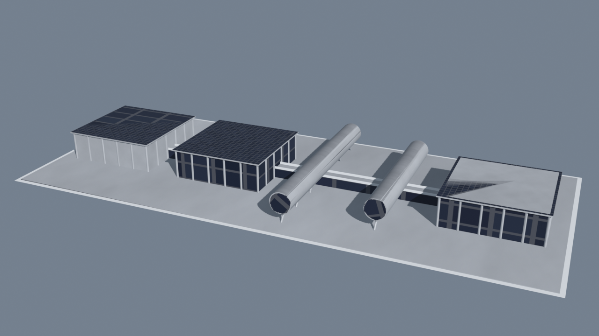
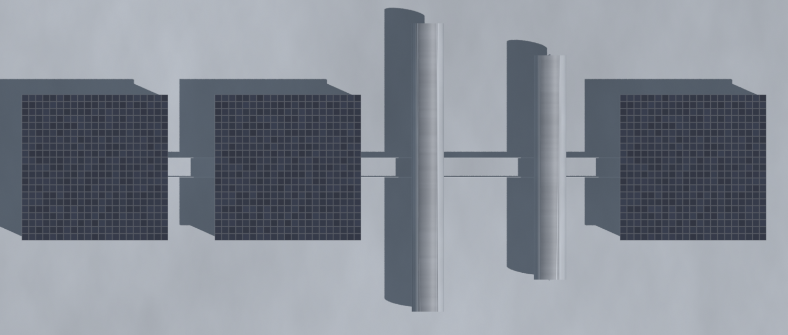

# CERN Science Gateway — Cities: Skylines II Landmark

A **landmark** asset of CERN's [Science Gateway](https://sciencegateway.cern/)
(Renzo Piano / RPBW, Geneva) for Cities: Skylines II, with a parametric Blender
build pipeline, a PBR texture set, and a small C# mod that grants the landmark's
city‑wide effects.

> Reinterpreted to sit on a **plaza** instead of spanning the Route de Meyrin.
> Built as a **landmark** (not a signature building) so it can use a larger
> footprint at true scale.




## Layout (true scale, real measurements)

A single line along the central elevated walkway:

```
building(43×43) ─17─ building(43×43) ─17─ ▮tube(90 ×⌀10)▮ ─28─ ▮tube(70 ×⌀10)▮ ─18─ building(43×43)
```

- Overall footprint ≈ **229 × 90 m** (oversized — that's why it's a landmark).
- Three low solar‑panel‑roofed pavilions on columns (pilotis).
- Two **tubes** crossing perpendicular to the walkway; tops aligned with the
  roof tops; **recessed glazed ends** (~5 m setback inside a thick‑walled rim).
- `SCALE` at the top of `build_cern_gateway.py` shrinks the whole thing
  (≈0.21 → ~48 m, fits a 6×6 lot) if you ever want it smaller.

## Contents

| File | What it is |
|------|------------|
| `build_cern_gateway.py` | Parametric Blender builder → `CERN_ScienceGateway.fbx` (main mesh + `_Gls`/`_Win`/`_Gra` sub‑meshes + `_LOD1`/`_LOD2`) |
| `generate_textures.py` | PBR texture set (PIL/numpy) as a concrete \| PV‑panel UV atlas |
| `render_preview.py` / `render_top.py` / `render_tubeend.py` | Preview renders (3/4, plan, tube‑end close‑up) |
| `render_setback_compare.py` | Compares tube‑end recess depths |
| `CERN_ScienceGateway.fbx` | The exported model |
| `CERN_ScienceGateway_*.png` | PBR maps: BaseColor / ControlMask / MaskMap / Normal / Emissive |
| `mod/` | C# code mod that attaches the city‑wide effects |

## Build

Requires [Blender](https://www.blender.org/) (tested 5.1) and Python with
`pillow` + `numpy` for the textures.

```bash
# model + FBX + a preview render
blender --background --python render_preview.py
# textures
python3 generate_textures.py
```

The FBX honours CS2 conventions: FBX (binary, Y‑up, metres), pivot at
bottom‑centre, ground on Z=0, one material named identically to the main mesh,
sub‑meshes carry no material, LOD1 < 50% of main tris, LOD2 ≤ 500 tris.

## Effects mod

Grants the landmark's city‑wide effects via a `CityModifier` buffer:

| Effect | Value |
|--------|-------|
| Interest in University Education | +5% |
| University Graduation Chance | +5% |
| Network (telecom) Capacity | +20,000 |

The `CityModifier` mechanism is the same for landmarks and signature buildings,
so the mod is category‑agnostic. The exact `CityModifierType` names are
version‑specific to your `Game.dll`; on first run the mod logs every enum value
so you can confirm them. See [`mod/README.md`](mod/README.md).

## Status

- [x] 3D model (true scale, to spec)
- [x] PBR textures (PV‑panel roofs)
- [x] Effects mod scaffold
- [ ] Confirm `CityModifierType` enum names on your game version
- [ ] Import in the in‑game editor as a Landmark prefab named `CERN_ScienceGateway`
- [ ] Build the mod with the CS2 modding toolchain

## Credits

Building design: Renzo Piano Building Workshop. This is a fan‑made game asset and
is not affiliated with CERN or RPBW.
